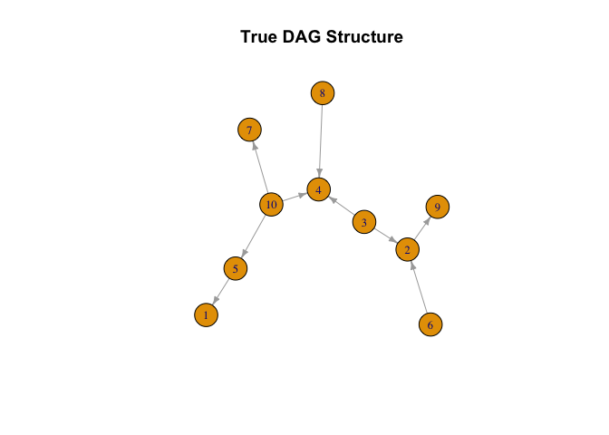
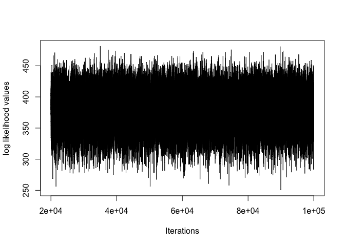
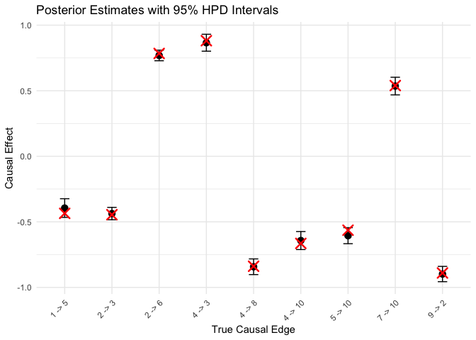
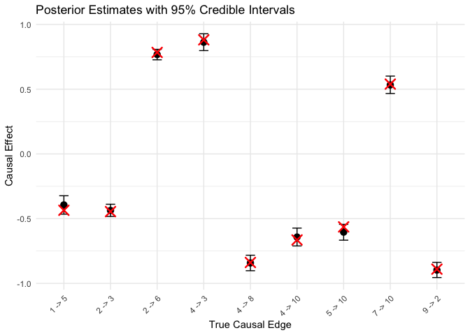
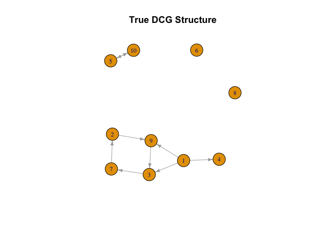
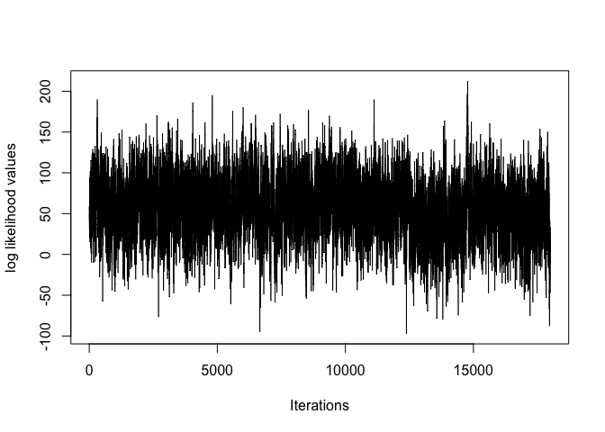
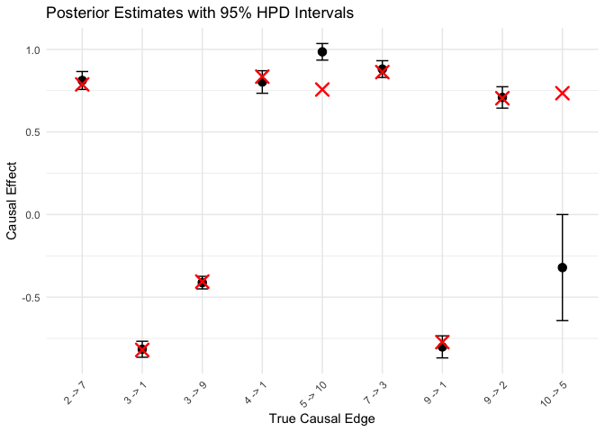
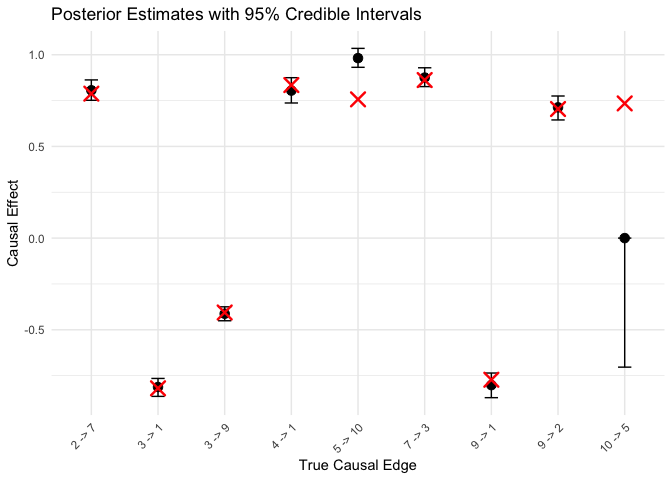

<!-- README.md is generated from README.Rmd. Please edit that file -->

# cyclinbayes

<!-- badges: start -->

<!-- badges: end -->

Cyclinbayes is an R package implementing bayesian methods for estimating
both directed acyclic graphs (DAGs) and directed cyclic graphs (DCGs).
The package provides full posterior inference for graph structures and
causal effects using a hierarchical Bayesian model, allowing principled
uncertainty quantification, edge inclusion probabilities, and credible
intervals.

For DAGs, cyclinbayes uses a hybrid MCMC scheme that combines collapsed
Gibbs sampling with simulated annealing to improve mixing and avoid
local optima. For DCGs, the package performs joint updates of adjacency
and causal effect coefficients using random walk proposals, enabling
inference in systems with feedback cycles. For DCGs, the package
performs joint updates of adjacency and causal effect coefficients using
random walk proposals, enabling inference in systems with feedback
cycles. In both settings, sparsity is effectively recovered using spike
and slab priors.

Implemented in Rcpp, cyclinbayes leverages optimized C++ routines to
handle large scale, high dimensional datasets.

## Installation from Github

You can install the development version of cyclinbayes from GitHub using
remotes:

``` r
#install.packages("remotes")
#remotes::install_github("roblee01/cyclinbayesrev")
```

Then load the package:

``` r
library(cyclinbayesrev)
library(ggplot2)
#> Warning: package 'ggplot2' was built under R version 4.5.2
library(igraph)
#> Warning: package 'igraph' was built under R version 4.5.2
#> 
#> Attaching package: 'igraph'
#> The following objects are masked from 'package:stats':
#> 
#>     decompose, spectrum
#> The following object is masked from 'package:base':
#> 
#>     union

# If using dist_type = "sid" and you see missing RBGL/graph:
#install.packages("BiocManager")
#BiocManager::install(c("graph", "RBGL"))
```

## Acyclic (DAG) Example

Below is a simple example demonstrating how to use the Bayesian LiNGAM
(DAG) sampler. Let $p$ denote the number of variables, $N$ the sample
size, and `num_iter` the number of MCMC iterations. Let
$i \in \{1,\ldots,p\}$ index variables and $q \in \{1,\ldots,N\}$ index
observations.

We generate structural errors from a finite Gaussian mixture model,

$$\epsilon_i^{(q)}
\sim
\sum_{k=1}^{M}
\pi_{ik}\,N(\mu_{ik},\tau_{ik}),$$

with

$$M=2,\qquad
(\mu_{i1},\mu_{i2})=(-0.5,0.5),\qquad
(\tau_{i1},\tau_{i2})=(0.1,0.3),\qquad
(\pi_{i1},\pi_{i2})=(0.5,0.5).$$

We generate a sparse DAG by including each candidate directed edge with
probability $1-\Delta=0.1$, where $\Delta=0.9$, while enforcing
acyclicity. For each included edge $j\to i$, the corresponding nonzero
causal-effect coefficient is generated according to

$$|B_{ij}| \sim \mathrm{Unif}(0.4,0.9),$$

with its sign chosen independently to be positive or negative with equal
probability. For excluded edges, $B_{ij}=0$.

Given the causal-effect matrix $B$ and structural error matrix
$\epsilon$, the observed data are generated from

$$Y=(I-B)^{-1}\epsilon,$$

where the $i$-th row of $Y$ corresponds to

$$(Y_i^{(1)},\ldots,Y_i^{(N)})^\top.$$

``` r
#######################################
# Simulation and MCMC settings
#######################################
N = 200 # Sample size for the test data
num_covariates = 10 # Number of features for test data
M = 5 # Number of finite clusters for mixed normal in likelihood
num_iter = 100000 # Total number of MCMC iterations
burn_in_iterations = 20000 # Discard initial draws; retain post-burn-in posterior samples

#######################################
# Hyperparameter setup
#######################################
params = list(
  a_mu      = 0,
  b_mu      = 2,
  a_gamma   = 0.5,
  b_gamma   = 0.5,
  a_gamma_1 = 2,
  b_gamma_1 = 1,
  a_og_tao = 0.01,
  b_og_tao = 0.01,
  a_tao     = 2,
  b_tao     = 1,
  alpha     = 1
)

#######################################
# Generate DAG Example
#######################################
example_list = generates_examples_DAG(
  num_covariates = num_covariates,
  N              = N,
  M_input        = 2,        # components used to GENERATE the errors
  prob_sparsity  = 0.90,     # = edge_prob 0.10
  seed_input     = 21, # the script's set.seed(20 + sim)
  mag_range      = c(0.4, 0.9),
  prob_positive  = 0.5,
  seed_structure = 1,        # dag_structure(seed = 1)
  seed_weights   = 20        # dag_weights(seed = 20)
)

data_matrix = example_list$data_matrix
Adjacency_matrix_true = example_list$Adjacency_matrix_true
Causal_effect_matrix_true = example_list$Causal_effect_matrix_true
Z_matrix_true = example_list$Z_matrix_true
```

Before examining posterior summaries, it is helpful to visualize the
true underlying DAG used in the simulation. This provides a direct point
of comparison for the estimated graph structures returned by the
sampler. The plot below displays the ground truth adjacency structure,
where each directed edge represents a causal relationship from one
variable to another.

``` r
#######################################
# Build directed graph from adjacency matrix
#######################################

g_true = igraph::graph_from_adjacency_matrix(
Adjacency_matrix_true,
mode = "directed",
diag = FALSE
)

plot(
  g_true,
  vertex.size = 20,
  vertex.label.cex = 0.8,
  edge.arrow.size = 0.5,
  main = "True DAG Structure"
)
```



With the simulated dataset and prior hyperparameters specified above, we
fit the Bayesian LiNGAM model using `BayesDAG().` The sampler runs for
`num_iter` iterations, but only post-burn-in draws are returned for
posterior analysis. The `burn_in_iterations` argument specifies how many
initial iterations are discarded. Because the DAG sampler uses an
annealing contribution during the early iterations, the implementation
ensures that the effective burn-in is at least 20% of `num_iter`; if a
smaller value is supplied, it is automatically increased to the end of
this annealing window. Thus, the returned samples correspond only to the
post-annealing posterior-sampling phase.

For each retained iteration $t$, the output includes:

- Adjacency matrix $E^{(t)}\in \{0,1\}^{p\times p}$
- Causal effect matrix $B^{(t)}\in \mathbb{R}^{p\times p}$
- Mixture parameters for the error model, with component specific means
  and variances/precisions stored in matrices (e.g.,
  $\mu^{(t)},\tau^{(t)}\in \mathbb{R}^{p\times M}$, where column $k$
  corresponds to mixture component $k$).

For posterior summaries, the retained matrices are flattened
(vectorized) into parameter vectors. Rows correspond to retained
posterior draws and columns correspond to fixed matrix entries (for
example, one column for $B_{ij}$ or $\mu_{ik}$). This makes edge
probabilities, HPD/credible intervals, and other posterior summaries
straightforward to compute.

``` r
#######################################
# Parameter Initialization
#######################################
B_seed = directlingam_seed(data_matrix)
seed_edge_threshold = 0.05   # drop |seed coef| below this
seed_rho_target = 0.95   # rescale if spectral radius exceeds this
seed_settle_sweeps = 30     # mixture Gibbs sweeps before handing off
#######################################
# Initialization
#######################################  
init_state = init_from_seed(
  B_seed, data_matrix, N, num_covariates, M,
  params$a_mu, params$b_mu, params$a_tao, params$b_tao, params$alpha,
  params$a_gamma, params$b_gamma, params$a_gamma_1, params$b_gamma_1,
  edge_threshold = seed_edge_threshold,
  rho_target     = seed_rho_target,
  settle_sweeps  = seed_settle_sweeps
)
#> init_from_seed: edges 9  rho 0.000  gamma_1 0.526  gamma_result 0.104  log-post 46.7
#######################################
# Run Bayesian DAG Sampler
#######################################

results_list = BayesDAG(
      data_matrix,
      params$a_mu, params$b_mu,
      params$a_gamma, params$b_gamma,
      params$a_tao, params$b_tao,
      params$a_og_tao, params$b_og_tao,
      params$a_gamma_1, params$b_gamma_1,
      params$alpha,
      M,
      num_iter,
      burn_in_iterations = burn_in_iterations,
      init_Adjacency     = init_state$Adjacency_matrix,
      init_Causal_effect = init_state$Causal_effect_matrix,
      init_mu            = init_state$mu_mat,
      init_tao           = init_state$tao_mat,
      init_pi            = init_state$pi_mat,
      init_Z             = init_state$Z_matrix,
      init_gamma_1       = init_state$gamma_1,
      init_gamma_result  = init_state$gamma_result
    )
#> [BayesDAG] 25%  (25000/100000)
#> [BayesDAG] 50%  (50000/100000)
#> [BayesDAG] 75%  (75000/100000)
#> [BayesDAG] done -- 100000 iterations

#######################################
# Extract posterior outputs
#######################################
log_likelihood_list = results_list$log_likelihood_list
Adjacency_matrix_list = results_list$Adjacency_matrix_list 
Causal_effect_matrix_list = results_list$Causal_effect_matrix_list
gamma_list = results_list$gamma_list
gamma_1_list = results_list$gamma_1_list
mu_matrix_list = results_list$mu_matrix_list
tao_matrix_list = results_list$tao_matrix_list
pi_matrix_list = results_list$pi_matrix_list

# Information about the retained posterior sample
first_stored_iteration = results_list$first_stored_iteration
posterior_sample_length = results_list$n_stored

first_stored_iteration
#> [1] 20001
posterior_sample_length
#> [1] 80000
```

All downstream posterior summaries use these retained post-burn-in
draws. In this example, `burn_in_iterations = 20000`, so the returned
posterior samples begin at iteration 20,001 and contain 80,000 draws.

To obtain a representative estimate of the graph structure, we use the
function `point_est_graph(),` which selects the posterior weighted
medoid, the graph that minimizes the weight distance to all other
sampled adjacency matrices. Users may select one of the built in
distances or supply their own custom functions. The available distance
metrics are:

- **Structural Hamming Distance (SHD):**  
  Counts the number of single edge edits (additions, deletions, or
  reversals) required to transform one graph into another.

- **Structural Intervention Distance (SID):**  
  Measures how many node pairs $(i, j)$ imply different intervention
  distributions P($\mathbf{Y}_j$ \| do($\mathbf{Y}_i$)).  
  (Applicable only when the posterior graphs are DAGs)

Users may also specify

``` r
dist_type = 'custom'
dist_fun = function(A,B){...}
```

where $A$ and $B$ are $p\times p$ adjacency matrices. The function must
return a non negative scalar distance.

``` r
#############################################
# Best Graph Structure determined through shd
#############################################
Adjacency_matrix_shd = point_est_graph(Adjacency_matrix_list, dist_type = 'shd')
Adjacency_matrix_shd
#>       [,1] [,2] [,3] [,4] [,5] [,6] [,7] [,8] [,9] [,10]
#>  [1,]    0    0    0    0    0    0    0    0    0     0
#>  [2,]    0    0    0    0    0    0    0    0    1     0
#>  [3,]    0    1    0    1    0    0    0    0    0     0
#>  [4,]    0    0    0    0    0    0    0    0    0     0
#>  [5,]    1    0    0    0    0    0    0    0    0     0
#>  [6,]    0    1    0    0    0    0    0    0    0     0
#>  [7,]    0    0    0    0    0    0    0    0    0     0
#>  [8,]    0    0    0    1    0    0    0    0    0     0
#>  [9,]    0    0    0    0    0    0    0    0    0     0
#> [10,]    0    0    0    1    1    0    1    0    0     0
```

``` r
############################################
# Best Graph Structure determined through sid
############################################
if (requireNamespace("SID", quietly = TRUE)) {
  Adjacency_matrix_sid = point_est_graph(Adjacency_matrix_list, dist_type = "sid")
  Adjacency_matrix_sid
} else {
  message("SID not installed. Install SID (and possibly Bioconductor graph/RBGL) to run SID.")
}
#>       [,1] [,2] [,3] [,4] [,5] [,6] [,7] [,8] [,9] [,10]
#>  [1,]    0    0    0    0    0    0    0    0    0     0
#>  [2,]    0    0    0    0    0    0    0    0    1     0
#>  [3,]    0    1    0    1    0    0    0    0    1     0
#>  [4,]    0    0    0    0    0    0    0    0    0     0
#>  [5,]    1    0    0    0    0    0    0    0    1     0
#>  [6,]    0    1    0    0    0    0    0    0    0     0
#>  [7,]    0    0    0    0    0    0    0    0    0     0
#>  [8,]    0    0    0    1    0    0    0    0    0     0
#>  [9,]    0    0    0    0    0    0    0    0    0     0
#> [10,]    1    0    0    1    1    0    1    0    0     0
```

As an example for a custom function, we could count the total number of
edge mismatches.

``` r
custom_edge_mismatch = function(A, B) {
  return(sum(abs(A - B)))
}

Adjacency_matrix_custom = point_est_graph(Adjacency_matrix_list, dist_type = 'custom', dist_fun = custom_edge_mismatch)
Adjacency_matrix_custom
#>       [,1] [,2] [,3] [,4] [,5] [,6] [,7] [,8] [,9] [,10]
#>  [1,]    0    0    0    0    0    0    0    0    0     0
#>  [2,]    0    0    0    0    0    0    0    0    1     0
#>  [3,]    0    1    0    1    0    0    0    0    0     0
#>  [4,]    0    0    0    0    0    0    0    0    0     0
#>  [5,]    1    0    0    0    0    0    0    0    0     0
#>  [6,]    0    1    0    0    0    0    0    0    0     0
#>  [7,]    0    0    0    0    0    0    0    0    0     0
#>  [8,]    0    0    0    1    0    0    0    0    0     0
#>  [9,]    0    0    0    0    0    0    0    0    0     0
#> [10,]    0    0    0    1    1    0    1    0    0     0
```

We observe that the structures selected using SHD and the custom edge
mismatch distance are identical, whereas the structure selected using
SID differs.

``` r
Adjacency_matrix_true
#>       [,1] [,2] [,3] [,4] [,5] [,6] [,7] [,8] [,9] [,10]
#>  [1,]    0    0    0    0    0    0    0    0    0     0
#>  [2,]    0    0    0    0    0    0    0    0    1     0
#>  [3,]    0    1    0    1    0    0    0    0    0     0
#>  [4,]    0    0    0    0    0    0    0    0    0     0
#>  [5,]    1    0    0    0    0    0    0    0    0     0
#>  [6,]    0    1    0    0    0    0    0    0    0     0
#>  [7,]    0    0    0    0    0    0    0    0    0     0
#>  [8,]    0    0    0    1    0    0    0    0    0     0
#>  [9,]    0    0    0    0    0    0    0    0    0     0
#> [10,]    0    0    0    1    1    0    1    0    0     0
```

In addition to choosing the best possible graphs through distance based
medoids, users may evaluate how often a graph appears in structure
appears in the posterior samples. This provides posterior support for
any candidate DAG, such as the true graph.

The function `posterior_network_motif()` computes the posterior mass
(relative frequency) of a graph by checking whether all its edges are
present on each of the posterior graph structures. Using the adjacency
samples from the acyclic example above, we can compute the posterior
mass assigned to the true graph:

``` r
true_graph_structure = igraph::graph_from_adjacency_matrix(Adjacency_matrix_true)
posterior_network_motif(true_graph_structure, Adjacency_matrix_list)
#> [1] 1
```

Since the value is at 1, this indicates that the sampler visited the
true graph structure repeatedly on every possible posterior graph
structure.

To inspect sampler behavior, we plot the log likelihood over the
retained posterior-sampling phase. Because `BayesDAG()` now returns only
post-burn-in draws, no additional indexing by `num_iter` is needed.

``` r
posterior_iterations = seq(
  from = first_stored_iteration,
  length.out = posterior_sample_length
)

plot(
  posterior_iterations,
  log_likelihood_list,
  type = 'l',
  xlab = 'Iterations',
  ylab = 'log likelihood values'
)
```



As shown above, the log-likelihood remains within a relatively stable
range during the retained posterior-sampling phase, providing empirical
evidence that the sampler has entered a stable sampling regime. The
graph summaries and interval estimates below are therefore computed
directly from the post-burn-in samples returned by `BayesDAG()`.

Posterior interval estimates are obtained using , which computes highest
posterior density (HPD) intervals and equal-tailed credible intervals
column-wise for each element of the sampled parameter matrices. To
illustrate posterior uncertainty in the causal-effect coefficients, we
examine the nonzero entries of the true causal-effect matrix $B$.

The figures below display the posterior estimates together with their
95% HPD and equal-tailed credible intervals. For each causal edge, the
red $\times$ marks the true value of the corresponding causal effect
coefficient, while the black point and vertical interval summarize the
posterior estimate and uncertainty. This allows each estimated effect to
be compared directly with its ground-truth value. Overall, the posterior
estimates lie close to the true effects, and the intervals generally
cover the corresponding ground-truth values, indicating accurate
recovery of the causal-effect magnitudes in this example.

``` r
#######################################
# Posterior intervals
#######################################

Causal_effect_matrix_summary =
  posterior_interval_est(Causal_effect_matrix_list, level = 0.95)

hpd_matrix_acyclic = Causal_effect_matrix_summary$hpd_matrix
ci_matrix_acyclic  = Causal_effect_matrix_summary$ci_matrix


#######################################
# True nonzero causal effects
#######################################

# R vectorizes matrices column-by-column
true_vec = as.vector(Causal_effect_matrix_true)

# Indices of all truly nonzero causal effects
true_idx = which(true_vec != 0)

# Convert vector indices back to matrix coordinates
coords = arrayInd(
  true_idx,
  .dim = dim(Causal_effect_matrix_true)
)

# Convention: B_ij is the effect j -> i
true_effects_df = data.frame(
  coef_index = true_idx,
  child  = coords[, 1],
  parent = coords[, 2],
  truth  = true_vec[true_idx]
)

true_effects_df$edge = paste0(
  true_effects_df$parent,
  " -> ",
  true_effects_df$child
)

#true_effects_df


#######################################
# Check dimensions before matching
#######################################

if (ncol(hpd_matrix_acyclic) != length(true_vec)) {
  stop("HPD matrix ordering/dimensions do not match Causal_effect_matrix_true.")
}

if (nrow(ci_matrix_acyclic) != length(true_vec)) {
  stop("CI matrix ordering/dimensions do not match Causal_effect_matrix_true.")
}


#######################################
# HPD intervals for TRUE causal effects
#######################################

hpd_sub = t(
  hpd_matrix_acyclic[, true_idx, drop = FALSE]
)

colnames(hpd_sub) = c("lower", "upper")

data_hpd = data.frame(
  edge  = true_effects_df$edge,
  truth = true_effects_df$truth,
  lower = hpd_sub[, "lower"],
  upper = hpd_sub[, "upper"]
)

# Midpoint of HPD interval
data_hpd$estimate =
  (data_hpd$lower + data_hpd$upper) / 2

# Keep edge order fixed
data_hpd$edge =
  factor(data_hpd$edge, levels = data_hpd$edge)


#######################################
# Plot HPD intervals
#######################################

ggplot(data_hpd, aes(x = edge, y = estimate)) +
  geom_errorbar(
    aes(ymin = lower, ymax = upper),
    width = 0.2
  ) +
  geom_point(size = 3) +

  # True causal effect
  geom_point(
    aes(y = truth),
    shape = 4,
    size = 4,
    stroke = 1.3,
    color = "red"
  ) +

  labs(
    x = "True Causal Edge",
    y = "Causal Effect",
    title = "Posterior Estimates with 95% HPD Intervals"
  ) +
  theme_minimal() +
  theme(
    axis.text.x = element_text(
      angle = 45,
      hjust = 1
    )
  )
```



``` r


#######################################
# 95% credible intervals for TRUE effects
#######################################

ci_sub =
  ci_matrix_acyclic[true_idx, , drop = FALSE]

data_ci = data.frame(
  edge     = true_effects_df$edge,
  truth    = true_effects_df$truth,
  lower    = ci_sub[, 1],
  estimate = ci_sub[, 2],
  upper    = ci_sub[, 3]
)

data_ci$edge =
  factor(data_ci$edge, levels = data_ci$edge)


#######################################
# Plot credible intervals
#######################################

ggplot(data_ci, aes(x = edge, y = estimate)) +
  geom_errorbar(
    aes(ymin = lower, ymax = upper),
    width = 0.2
  ) +
  geom_point(size = 3) +

  # True causal effect
  geom_point(
    aes(y = truth),
    shape = 4,
    size = 4,
    stroke = 1.3,
    color = "red"
  ) +

  labs(
    x = "True Causal Edge",
    y = "Causal Effect",
    title = "Posterior Estimates with 95% Credible Intervals"
  ) +
  theme_minimal() +
  theme(
    axis.text.x = element_text(
      angle = 45,
      hjust = 1
    )
  )
```



``` r


#######################################
# Coverage
#######################################

data_hpd$covered =
  data_hpd$truth >= data_hpd$lower &
  data_hpd$truth <= data_hpd$upper

data_ci$covered =
  data_ci$truth >= data_ci$lower &
  data_ci$truth <= data_ci$upper

cat(
  "HPD coverage:",
  sum(data_hpd$covered),
  "out of",
  nrow(data_hpd),
  "\n"
)
#> HPD coverage: 9 out of 9

cat(
  "Credible interval coverage:",
  sum(data_ci$covered),
  "out of",
  nrow(data_ci),
  "\n"
)
#> Credible interval coverage: 9 out of 9
```

The figures compare posterior estimates of the nonzero causal effect
coefficients with their true simulated values. Black points and vertical
lines represent the posterior estimates and corresponding 95% intervals,
while red crosses indicate the true causal effects.

In this acyclic example, the posterior estimates closely match the true
causal-effect coefficients across all true edges. The 95% HPD and
equal-tailed credible intervals contain, or closely surround, the
corresponding true values, indicating accurate recovery of both the
direction and magnitude of the nonzero causal effects. The HPD and equal
tailed intervals are also very similar, suggesting relatively well
concentrated posterior distributions for the estimated effects in this
example.

## Cyclic (DCG) Example

Finally, to illustrate the cyclic Bayesian sampler, we generate a
directed cyclic graph (DCG) containing at least one directed cycle. The
graph is generated under the disjoint-cycle restriction used by
`BayesDCG`, so that no two directed cycles share a node.

For each included edge $j \to i$, the corresponding nonzero
causal-effect coefficient is generated according to

$$|B_{ij}| \sim \mathrm{Unif}(0.4,0.9),$$

with its sign chosen independently to be positive or negative with equal
probability. For excluded edges, $B_{ij}=0$.

Because feedback is present in a cyclic model, we additionally require
the causal-effect matrix to satisfy the stability condition

<div style="text-align: center; margin: 1em 0;">

ρ(B) = max { \|λ\| : λ ∈ eig(B) } \< 1.

</div>

Here, ρ(B) denotes the spectral radius of the causal-effect matrix.
Given the causal-effect matrix $B$ and structural error matrix
$\epsilon$, the observed data are generated from

$$Y = (I-B)^{-1}\epsilon.$$

The resulting data therefore arise from a stable linear non-Gaussian
cyclic structural equation model with disjoint directed cycles.

``` r
#######################################
# Simulation and MCMC settings
#######################################

N = 200
num_covariates = 10
M = 5
num_iter = 100000
burn_in_iterations = 70000


#######################################
# Hyperparameter setup
#######################################

params = list(
  a_mu      = 0,
  b_mu      = 2,
  a_gamma   = 1,
  b_gamma   = 20,
  a_gamma_1 = 0.5,
  b_gamma_1 = 0.5,
  a_tao     = 2,
  b_tao     = 1,
  alpha     = 1
)


#######################################
# Generate DCG Example
#######################################

example_list = generates_examples_DCG(
  num_covariates = num_covariates,
  N              = N,
  M_input        = 2,          # components used to generate the errors
  prob_sparsity  = 0.90,       # target edge density = 0.10
  seed_input     = 21,
  n_cycles       = 2,          # four vertex-disjoint directed cycles
  len_range      = c(2, 4),
  mag_range      = c(0.4, 0.9),
  prob_positive  = 0.5,
  tol_sing       = 0.05,
  rho_max        = 0.95
)


#######################################
# Extract generated data
#######################################

data_matrix = example_list$data_matrix
Adjacency_matrix_true = example_list$Adjacency_matrix_true
Causal_effect_matrix_true = example_list$Causal_effect_matrix_true
Z_matrix_true = example_list$Z_matrix_true

cycles_true = example_list$cycles
rho_true = example_list$rho


#######################################
# Inspect generated DCG
#######################################

cycles_true
#> [[1]]
#> [1] 3 9 2 7
#> 
#> [[2]]
#> [1]  5 10
rho_true
#> [1] 0.7454885
```

The generated DCG can be inspected using `cycles_true` and `rho_true`.
Here, `cycles_true` lists the directed cycles used to construct the
graph. For this example, the generated graph contains two
vertex-disjoint cycles:

- `3 -> 9 -> 2 -> 7 -> 3`
- `5 -> 10 -> 5`

Thus, no node belongs to more than one directed cycle, consistent with
the disjoint-cycle restriction used by `BayesDCG`.

The value `rho_true = 0.7454885` is the spectral radius of the generated
causal-effect matrix. Since this value is below the specified stability
threshold (`rho_max = 0.95` in this example), the generated DCG
satisfies the stability requirement.

``` r
#######################################
# Parameter Initialization
#######################################

B_seed = directlingam_seed(data_matrix)

seed_edge_threshold = 0.05   # drop |seed coef| below this
seed_rho_target     = 0.95   # stabilize initialization if needed
seed_settle_sweeps  = 30     # mixture Gibbs sweeps before handing off

#######################################
# Initialization
#######################################

init_state = init_from_seed(
  B_seed, data_matrix, N, num_covariates, M,
  params$a_mu, params$b_mu,
  params$a_tao, params$b_tao,
  params$alpha,
  params$a_gamma, params$b_gamma,
  params$a_gamma_1, params$b_gamma_1,
  edge_threshold = seed_edge_threshold,
  rho_target     = seed_rho_target,
  settle_sweeps  = seed_settle_sweeps
)
#> init_from_seed: edges 8  rho 0.000  gamma_1 0.526  gamma_result 0.081  log-post -409.9


#######################################
# Run Bayesian DCG Sampler
#######################################

results_list = BayesDCG(
  data_matrix = data_matrix,

  a_mu      = params$a_mu,
  b_mu      = params$b_mu,
  a_gamma   = params$a_gamma,
  b_gamma   = params$b_gamma,
  a_tao     = params$a_tao,
  b_tao     = params$b_tao,
  a_gamma_1 = params$a_gamma_1,
  b_gamma_1 = params$b_gamma_1,
  alpha     = params$alpha,

  M        = M,
  num_iter = num_iter,

  burn_in_iterations = burn_in_iterations,

  init_Adjacency     = init_state$Adjacency_matrix,
  init_Causal_effect = init_state$Causal_effect_matrix,
  init_mu            = init_state$mu_mat,
  init_tao           = init_state$tao_mat,
  init_pi            = init_state$pi_mat,
  init_Z             = init_state$Z_matrix,
  init_gamma_1       = init_state$gamma_1,
  init_gamma_result  = init_state$gamma_result
)
#> [BayesDCG two-phase] 25%  (25000/100000)
#> [BayesDCG two-phase] 50%  (50000/100000)
#> [BayesDCG two-phase] 75%  (75000/100000)
#> [BayesDCG two-phase] done -- 100000 iterations


#######################################
# Extract posterior outputs
#######################################

log_likelihood_list        = results_list$log_likelihood_list
Adjacency_matrix_list      = results_list$Adjacency_matrix_list
Causal_effect_matrix_list  = results_list$Causal_effect_matrix_list
gamma_list                 = results_list$gamma_list
gamma_1_list               = results_list$gamma_1_list
mu_matrix_list             = results_list$mu_matrix_list
tao_matrix_list            = results_list$tao_matrix_list
pi_matrix_list             = results_list$pi_matrix_list

# Number of retained posterior graph samples
posterior_sample_length = nrow(Adjacency_matrix_list)
```

Before examining posterior summaries, again we will visualize the true
underlying DCG used in the simulation. The plot below displays the
ground truth adjacency structure.

``` r
#######################################
# Build directed graph from adjacency matrix
#######################################

g_true = graph_from_adjacency_matrix(
Adjacency_matrix_true,
mode = "directed",
diag = FALSE
)

plot(
  g_true,
  vertex.size = 20,
  vertex.label.cex = 0.8,
  edge.arrow.size = 0.5,
  main = "True DCG Structure"
)
```



With the simulated dataset and prior hyperparameters specified above, we
now fit the Bayesian LiNGAM model using `BayesDCG().` The function,
similar to `BayesDAG(),` returns same posterior samples for

- Adjacency matrices,
- Causal effect matrices,
- Mixture parameters for the error model, with component specific means
  and variances/precisions stored in matrices.

To obtain a representative estimate of the graph structure, we again use
the function `point_est_graph(),` which selects the posterior weighted
medoid under a chosen distance metric. We use the same distance metrics,
but the Structural Intervention Distance (SID) is only applicable when
the sampled graphs are DAGs. Users may select shd or supply their own
custom functions.

``` r
# SID is shown for completeness, it applies only when all posterior graphs are DAGs. If any sampled graph contains a cycle, SID-based selection will produce an error.
Adjacency_matrix_sid = point_est_graph(Adjacency_matrix_list, dist_type = 'sid')
#> Error in `sid_matrix()`:
#> ! SID distance requires all graphs to be DAGs.
```

``` r
Adjacency_matrix_shd = point_est_graph(Adjacency_matrix_list,dist_type = 'shd')
Adjacency_matrix_shd
#>       [,1] [,2] [,3] [,4] [,5] [,6] [,7] [,8] [,9] [,10]
#>  [1,]    0    0    1    1    0    0    0    0    1     0
#>  [2,]    0    0    0    0    0    0    0    0    1     0
#>  [3,]    0    0    0    0    0    0    1    0    0     0
#>  [4,]    0    0    0    0    0    0    0    0    0     0
#>  [5,]    0    0    0    0    0    0    0    0    0     0
#>  [6,]    0    0    0    0    0    0    0    0    0     0
#>  [7,]    0    1    0    0    0    0    0    0    0     0
#>  [8,]    0    0    0    0    0    0    0    0    0     0
#>  [9,]    0    0    1    0    0    0    0    0    0     0
#> [10,]    0    0    0    0    1    0    0    0    0     0
```

Using the same custom function as the acyclic case, we get following
graph structure.

``` r
Adjacency_matrix_custom = point_est_graph(Adjacency_matrix_list, dist_type = 'custom', dist_fun = custom_edge_mismatch)
Adjacency_matrix_custom
#>       [,1] [,2] [,3] [,4] [,5] [,6] [,7] [,8] [,9] [,10]
#>  [1,]    0    0    1    1    0    0    0    0    1     0
#>  [2,]    0    0    0    0    0    0    0    0    1     0
#>  [3,]    0    0    0    0    0    0    1    0    0     0
#>  [4,]    0    0    0    0    0    0    0    0    0     0
#>  [5,]    0    0    0    0    0    0    0    0    0     0
#>  [6,]    0    0    0    0    0    0    0    0    0     0
#>  [7,]    0    1    0    0    0    0    0    0    0     0
#>  [8,]    0    0    0    0    0    0    0    0    0     0
#>  [9,]    0    0    1    0    0    0    0    0    0     0
#> [10,]    0    0    0    0    1    0    0    0    0     0
```

In this example, the selected graphs coincide with the true adjacency
matrix:

``` r
Adjacency_matrix_true
#>       [,1] [,2] [,3] [,4] [,5] [,6] [,7] [,8] [,9] [,10]
#>  [1,]    0    0    1    1    0    0    0    0    1     0
#>  [2,]    0    0    0    0    0    0    0    0    1     0
#>  [3,]    0    0    0    0    0    0    1    0    0     0
#>  [4,]    0    0    0    0    0    0    0    0    0     0
#>  [5,]    0    0    0    0    0    0    0    0    0     1
#>  [6,]    0    0    0    0    0    0    0    0    0     0
#>  [7,]    0    1    0    0    0    0    0    0    0     0
#>  [8,]    0    0    0    0    0    0    0    0    0     0
#>  [9,]    0    0    1    0    0    0    0    0    0     0
#> [10,]    0    0    0    0    1    0    0    0    0     0
```

In addition to choosing the best possible graphs through distance based
medoids, users similarly may evaluate how often a graph appears in
structure appears in the posterior samples using
`posterior_network_motif().` This provides posterior support for any
candidate DCG, such as the true graph.

``` r
true_graph_structure = igraph::graph_from_adjacency_matrix(Adjacency_matrix_true)
posterior_network_motif(true_graph_structure, Adjacency_matrix_list)
#> [1] 0.7012778
```

The posterior probability of the true network motif is $0.7013$,
indicating that the motif is present in approximately $70.1\%$ of the
retained posterior graph samples. This suggests substantial posterior
support for the underlying structural feature, even though the exact
full graph structure may vary across posterior draws.

Similar to the acyclic case, to check whether the sampler has mixed well
and is exploring the parameter space well, we again inspect the log
likelihood. Below we plot the log likelihood for each iteration to
assess mixing and posterior behavior:

``` r
plot(log_likelihood_list, type='l', xlab = 'Iterations', ylab = 'log likelihood values')
```


As seen overall, the log_likelihoods stay in the same general area
indicating the sampler has reached a stationary regime, indicating
posterior summaries for the other parameters are from a well converged
chain. Similar to the acyclic case, we can summarize uncertainty in the
causal effect coefficients using `posterior_interval_est(),` which
computes HPD and equal tailed credible intervals for each specific
parameter entry represented as columns of the matrix outputs.

``` r
#######################################
# Posterior intervals
#######################################

Causal_effect_matrix_summary =
  posterior_interval_est(
    Causal_effect_matrix_list,
    level = 0.95
  )

hpd_matrix_cyclic = Causal_effect_matrix_summary$hpd_matrix
ci_matrix_cyclic  = Causal_effect_matrix_summary$ci_matrix


#######################################
# True nonzero causal effects
#######################################

# R vectorizes matrices column-by-column
true_vec = as.vector(Causal_effect_matrix_true)

# Indices of all truly nonzero causal effects
true_idx = which(true_vec != 0)

# Convert vector indices back to matrix coordinates
coords = arrayInd(
  true_idx,
  .dim = dim(Causal_effect_matrix_true)
)

# Convention:
# B_ij is the causal effect j -> i
true_effects_df = data.frame(
  coef_index = true_idx,
  child  = coords[, 1],
  parent = coords[, 2],
  truth  = true_vec[true_idx]
)

true_effects_df$edge = paste0(
  true_effects_df$parent,
  " -> ",
  true_effects_df$child
)


#######################################
# Check dimensions before matching
#######################################

if (ncol(hpd_matrix_cyclic) != length(true_vec)) {
  stop(
    "HPD matrix ordering/dimensions do not match Causal_effect_matrix_true."
  )
}

if (nrow(ci_matrix_cyclic) != length(true_vec)) {
  stop(
    "CI matrix ordering/dimensions do not match Causal_effect_matrix_true."
  )
}


#######################################
# HPD intervals for TRUE causal effects
#######################################

hpd_sub = t(
  hpd_matrix_cyclic[
    ,
    true_idx,
    drop = FALSE
  ]
)

colnames(hpd_sub) = c(
  "lower",
  "upper"
)

data_hpd_cyclic = data.frame(
  edge  = true_effects_df$edge,
  truth = true_effects_df$truth,
  lower = hpd_sub[, "lower"],
  upper = hpd_sub[, "upper"]
)

# Midpoint of HPD interval
data_hpd_cyclic$estimate =
  (
    data_hpd_cyclic$lower +
    data_hpd_cyclic$upper
  ) / 2

# Keep edge order fixed
data_hpd_cyclic$edge =
  factor(
    data_hpd_cyclic$edge,
    levels = data_hpd_cyclic$edge
  )


#######################################
# Plot HPD intervals
#######################################

ggplot(
  data_hpd_cyclic,
  aes(
    x = edge,
    y = estimate
  )
) +

  # 95% HPD interval
  geom_errorbar(
    aes(
      ymin = lower,
      ymax = upper
    ),
    width = 0.2
  ) +

  # Posterior estimate
  geom_point(
    size = 3,
    color = "black"
  ) +

  # True causal effect: red X
  geom_point(
    aes(
      y = truth
    ),
    shape = 4,
    size = 4,
    stroke = 1.3,
    color = "red"
  ) +

  labs(
    x = "True Causal Edge",
    y = "Causal Effect",
    title = "Posterior Estimates with 95% HPD Intervals"
  ) +

  theme_minimal() +

  theme(
    axis.text.x = element_text(
      angle = 45,
      hjust = 1
    )
  )
```



``` r


#######################################
# 95% credible intervals
# for TRUE causal effects
#######################################

ci_sub =
  ci_matrix_cyclic[
    true_idx,
    ,
    drop = FALSE
  ]

data_ci_cyclic = data.frame(
  edge     = true_effects_df$edge,
  truth    = true_effects_df$truth,
  lower    = ci_sub[, 1],
  estimate = ci_sub[, 2],
  upper    = ci_sub[, 3]
)

# Keep edge order fixed
data_ci_cyclic$edge =
  factor(
    data_ci_cyclic$edge,
    levels = data_ci_cyclic$edge
  )


#######################################
# Plot credible intervals
#######################################

ggplot(
  data_ci_cyclic,
  aes(
    x = edge,
    y = estimate
  )
) +

  # 95% credible interval
  geom_errorbar(
    aes(
      ymin = lower,
      ymax = upper
    ),
    width = 0.2
  ) +

  # Posterior estimate
  geom_point(
    size = 3,
    color = "black"
  ) +

  # True causal effect: red X
  geom_point(
    aes(
      y = truth
    ),
    shape = 4,
    size = 4,
    stroke = 1.3,
    color = "red"
  ) +

  labs(
    x = "True Causal Edge",
    y = "Causal Effect",
    title = "Posterior Estimates with 95% Credible Intervals"
  ) +

  theme_minimal() +

  theme(
    axis.text.x = element_text(
      angle = 45,
      hjust = 1
    )
  )
```



``` r


#######################################
# Coverage
#######################################

data_hpd_cyclic$covered =
  data_hpd_cyclic$truth >= data_hpd_cyclic$lower &
  data_hpd_cyclic$truth <= data_hpd_cyclic$upper

data_ci_cyclic$covered =
  data_ci_cyclic$truth >= data_ci_cyclic$lower &
  data_ci_cyclic$truth <= data_ci_cyclic$upper


cat(
  "HPD coverage:",
  sum(data_hpd_cyclic$covered),
  "out of",
  nrow(data_hpd_cyclic),
  "\n"
)
#> HPD coverage: 7 out of 9

cat(
  "Credible interval coverage:",
  sum(data_ci_cyclic$covered),
  "out of",
  nrow(data_ci_cyclic),
  "\n"
)
#> Credible interval coverage: 7 out of 9
```

The figures compare posterior estimates of the nonzero causal-effect
coefficients with their true simulated values. Black points and vertical
lines represent the posterior estimates and corresponding 95% intervals,
while red crosses indicate the true causal effects.

For most edges, the posterior estimates are close to the true values and
the intervals contain or closely approach the corresponding true
effects. The largest discrepancies occur for the reciprocal edges
`5 -> 10` and `10 -> 5`, which form a two-node directed cycle in the
true graph. In particular, the posterior provides relatively weak
support for the `10 -> 5` effect, resulting in substantial posterior
mass near zero and an interval that does not contain the true positive
coefficient. The `5 -> 10` effect is retained but is overestimated in
this example.

These results illustrate that uncertainty in the causal-effect estimates
reflects both uncertainty in graph selection and uncertainty in the
magnitude of an included edge. In particular, coefficients are equal to
zero in posterior draws for which the corresponding edge is absent.

## Documentation (vignette + appendix)

For a complete tutorial **and the supplemental material** (appendix with
additional simulations and implementation details), see the package
vignette:

``` r
#browseVignettes("cyclinbayes")
```
